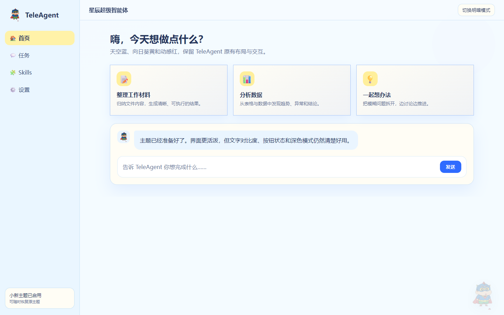
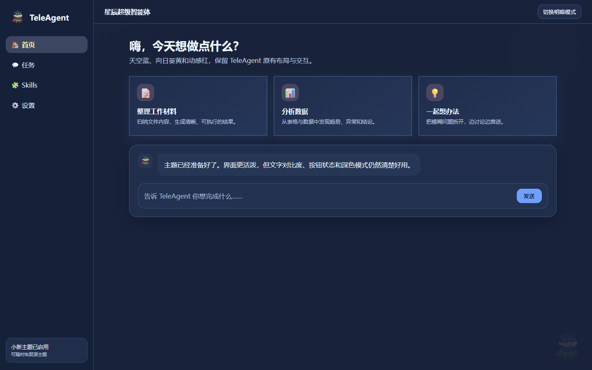

# TeleAgent 蜡笔小新主题

为 Windows 版 TeleAgent 提供可恢复的蜡笔小新界面主题，包含浅色与深色配色、角色装饰、预览页面，以及带备份和哈希校验的一键安装/卸载脚本。

## 使用

1. 下载或克隆本仓库。
2. 双击 `一键安装主题.bat`。
3. 如需恢复原界面，双击 `一键卸载主题.bat`。

当前已验证 TeleAgent `2.5.2`。安装器会先生成主题归档、备份当前 `app.asar`，再关闭并重新打开 TeleAgent；卸载时会校验备份哈希后恢复。遇到未验证版本时，安装器默认停止，不会强行覆盖。

## Skill

仓库同时采用 Skill 结构。自动化代理应先阅读 [`SKILL.md`](SKILL.md)，并使用 `scripts/test-theme.ps1` 对新版本执行不修改现有安装的离线构建测试。

## 预览

## 说明

本项目是非官方界面主题，不修改 TeleAgent 的账号、会话、工具或用户数据。TeleAgent 更新可能替换主题资源，更新后应重新验证并安装。
