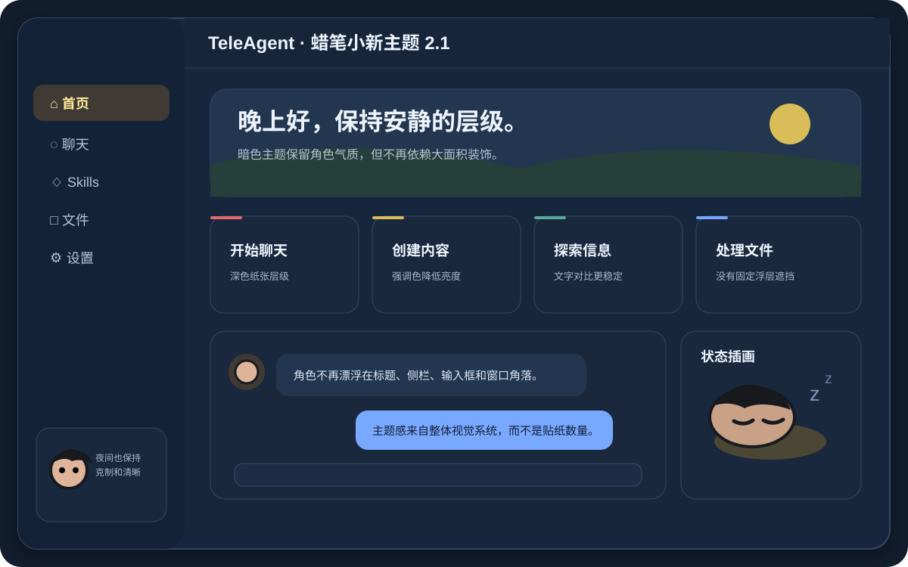

# TeleAgent 蜡笔小新主题

为 Windows 版 TeleAgent 提供可恢复的蜡笔小新风格界面主题。`2.1.0` 版重新收敛视觉方案：取消覆盖真实界面的常驻角色贴纸、绿色泛光和大面积装饰层，改用更克制的配色、纸张感卡片、细线条强调和局部状态插画，同时保留 2.0.1 已修复的启动兼容方案。

## 使用

1. 下载或克隆本仓库。
2. 双击 `一键安装主题.bat`。
3. 如需恢复原界面，双击 `一键卸载主题.bat`。

当前已验证 TeleAgent `2.5.2`。安装器会保留原包的外置运行文件标记，同步更新 Electron 的 ASAR 完整性指纹，并备份 `app.asar` 与 `TeleAgent.exe`，再关闭并重新打开 TeleAgent；卸载时会校验备份哈希后恢复。遇到未验证版本时，安装器默认停止，不会强行覆盖。

由于 TeleAgent 2.5.2 把 ASAR 指纹嵌入已签名的启动程序，安装主题期间 Windows 会把 `TeleAgent.exe` 显示为“签名哈希不匹配”；卸载主题会恢复保留的原始签名文件。若设备安全策略禁止运行已修改的签名程序，请不要安装此主题。

## 2.1 视觉方案

2.1 不再把角色固定贴在窗口右上角、右下角、侧栏和输入区。真实 TeleAgent 界面以颜色变量、卡片边框、输入框、弹窗、聊天气泡、滚动条以及浅色/深色模式作为主要主题载体；角色插画保留在有明确边界的预览和状态场景中。

新版重点修正：

- 删除右上角探头贴纸、右下角站立人物、底部半透明睡觉人物、左下角小白等常驻覆盖。
- 删除 `[class*="sidebar"]`、`[class*="header"]` 这类过宽选择器，避免误伤内部组件。
- 取消侧栏绿色雾化与底部草地叠层。
- 主页卡片改为奶油白纸张底 + 小面积红/黄/青/蓝顶部强调线。
- 浅色和深色模式分别调整对比度，不再依赖降低整张插画透明度。
- 重新绘制小新、小白、睡觉状态和场景 SVG，统一线条与比例。

## 启动兼容

主题仍使用修复后的安全安装链路：保留 `dist-electron/im-service`、`better-sqlite3`、`bindings`、`file-uri-to-path` 的 `app.asar.unpacked` 标记，并同步更新 `TeleAgent.exe` 中的 ASAR header SHA-256。视觉重做没有移除或绕过这部分逻辑。

## Skill

仓库采用 Skill 结构。自动化代理应先阅读 [`SKILL.md`](SKILL.md)，并使用 `scripts/test-theme.ps1` 对新版本执行不修改现有安装的离线构建测试。

## 预览

## 说明

本项目是非官方界面主题，不修改 TeleAgent 的账号、会话、工具或用户数据。TeleAgent 更新可能替换主题资源，更新后应重新验证并安装。
